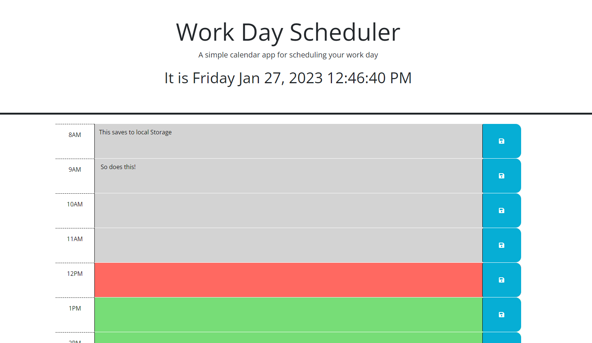

# Week-Five-Challenge
Week five challenge for UCI bootcamp, scheduler
## Project Description
The objective for this project was to create a work day planner/schdeuler.
THe planner needs to display hour-blocks for each hour of the work day.
In each hour block the user should be able to write information needed for planning the day and save it by clicking the button to the right of the text area
The saved data will persist in local storage until overwritten and will load automatically when the page is visited
For ease the planners colors will update as time passes to indicate whether that hour has already passed, it is currently that hour, or the hour is still yet to come.

## Credits

For this project I was given starter code from our class repository which contained fully functional index.html and style.css documents. These documents were updated as needed to provide functionality.

## Deployemnt

You can find the deployed application here:
https://carechiga.github.io/Week-Five-Challenge/